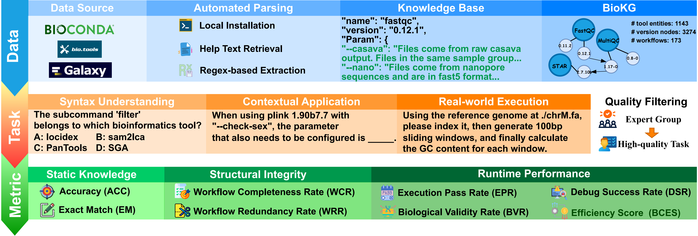

# BioFlowBench: A Comprehensive Benchmark for Evaluating Bioinformatics Tool-use Capabilities of LLMs and Agents


## 🧬 Overview

BioFlowBench is the first multi-layered benchmark designed to rigorously evaluate the bioinformatics tool-use capabilities of Large Language Models (LLMs) and agent frameworks. By leveraging a massive bioinformatics knowledge graph and automated data generation, BioFlowBench bridges the gap between static knowledge and real-world scientific execution.


* **Knowledge-Graph Driven**: Built upon BioKG, a multi-source knowledge graph featuring 1,143 tool entities, 3,274 version nodes, and 173 workflows.

* **Diverse Biological Domains**: Includes 5,071 samples covering Genomics, Transcriptomics, and Proteomics.

* **BioGen Framework**: An agent-driven automation engine that generates compact, low-overhead synthetic biological data for scalable and cost-effective testing.

* **Multi-Dimensional Evaluation**: Goes beyond simple accuracy to measure Structural Integrity, Functional Validity, and Efficiency Metrics.



## 📊 Multi-dimensional Evaluation Framework

BioFlowBench assesses models across four critical dimensions:

### I. Static Knowledge

* **Accuracy (Acc)**: Performance on single-choice syntax questions.
* **Exact Match (EM)**: Precision in recalling specific parameters or tool names.

### II. Structural Integrity Metrics

* **Workflow Completeness Rate (WCR)**: Ratio of correctly invoked tools vs. required tools.
* **Workflow Redundancy Rate (WRR)**: Measures "hallucinated" or unnecessary intermediate steps.

### III. Functional Validity Metrics

* **Execution Pass Rate (EPR)**: Percentage of workflows that execute without system errors.
* **Biological Validity Rate (BVR)**: The "Gold Standard"—verifies if the output is scientifically accurate via the validation toolchain.
* **Debug Success Rate (DSR)**: It quantifies the ratio of initially failed tasks that are successfully recovered through the agent's iterative self-debugging process.

### IV. Efficiency Metric

* **Bio-Computational Efficiency Score (BCES)**: Balances biological accuracy against token cost.


## 📁 Dataset Structure


| Module | File | Format | Description |
| --- | --- | --- | --- |
| **Module 1** | `Dataset/Syntax_Understanding.json` | Single Choice | Tests tool definitions, parameters, and version sensitivity. |
| **Module 2** | `Dataset/Contextual_Application.json` | Fill-in-the-Blank | Tests the ability to apply tools in specific biological contexts. |
| **Module 3** | `BioGen` | Workflow | Executable shell commands and validation scripts. |

The **BioGen** pipeline relies on a structured data repository located in the `BioGen` directory. This organization ensures that the agent can autonomously retrieve seeds, invoke tools, and construct workflows based on the **BioKG** (Bioinformatics Knowledge Graph).

### Directory Breakdown

* **`BioGen/bio_seeds/`**: Contains the "Seed Files" (e.g., `chrM.fa`, `uniprot_sprot.fasta`). These are high-quality, lightweight biological fragments used as the starting point for data synthesis.
* **`BioGen/tools/`**: Houses the implementation of "Synthesis Tools" (e.g., `wgsim`, `art`, `pyopenms`). These are the Python wrappers and command-line utilities that BioGen invokes to transform seeds into task-specific inputs.
* **`BioGen/biokg_data/`**: The core of the benchmark tasks. It contains curated workflow data extracted from our BioKG, categorized by complexity:
* **Simple**: 2-step tool chains (e.g., FastQC -> MultiQC).
* **Medium**: 3–5 step sequences (e.g., BWA -> Samtools -> Bcftools).
* **Hard**: Complex, multi-step real-world pipelines (6+ tools).

## 🚀 Quick Start


### 1. Module 1: Syntax Understanding Evaluation

This module evaluates the model's fundamental comprehension using a Single-Choice Question format.

```python
# Configure your API in the ExamAgent class within the script
python Eval_SU.py
```

### 2. Module 2: Contextual Application Evaluation

This module uses a Cloze Test (Fill-in-the-Blank) format to test reasoning in realistic scenarios.

```python
# The script evaluates Exact Match (EM) for the [BLANK] values
python Eval_CA.py
```

### 3. BioGen: Automated Data Synthesis (Module 3)


#### How it works:

1. **WorkflowPlan**: The agent designs a synthesis plan using "Seed Files" (e.g., `chrM.fa`) and "Synthesis Tools" (e.g., `wgsim`) to generate the specific input required for the first tool in a target workflow.
2. **BenchmarkOutput**: It generates three key components:
* `user_query`: A natural language request describing the scientific goal.
* `ground_truth_script`: The gold-standard sequence of bash commands.
* `validation_command`: A command for the "Validation Tool" (Tool N) to verify the biological integrity of the final output.

#### Execution Example:

```python

# Initialize the agent with your LLM configuration
agent = BioDataForgeAgent()

# Load a target tool sequence from BioGen/biokg_data/
workflow_tools = [
        {
            "name": "bwa mem",
            "desc": "Aligns DNA sequencing reads to a reference genome.",
            "version": "0.7.17",
            "cmd_template": "bwa mem <ref.fa> <read1.fq> <read2.fq> > <output.sam>",
            "input_type": "Paired-end FASTQ & Reference FASTA"
        },
        {
            "name": "samtools view",
            "desc": "Converts SAM to BAM format.",
            "version": "1.10",
            "cmd_template": "samtools view -bS <input.sam> > <output.bam>",
            "input_type": "SAM file"
        },
        {
            "name": "samtools sort",
            "desc": "Sorts the BAM file by coordinates.",
            "version": "1.10",
            "cmd_template": "samtools sort <input.bam> -o <output.sorted.bam>",
            "input_type": "BAM file"
        },
        {
            "name": "samtools index",
            "desc": "Creates an index for the sorted BAM file (Validation step).",
            "version": "1.10",
            "cmd_template": "samtools index <input.sorted.bam>",
            "input_type": "Sorted BAM file"
        }
    ]

# Create and execute the plan to generate real test data
plan = agent.create_plan(workflow_tools)
executed_plan = agent.execute_plan(plan)

# Generate the final benchmark case
benchmark = agent.generate_final_benchmark(executed_plan, workflow_tools)

```


## 📊 Experimental Results
We evaluated 8 LLMs and 4  agent frameworks using the BioFlowBench suite.


